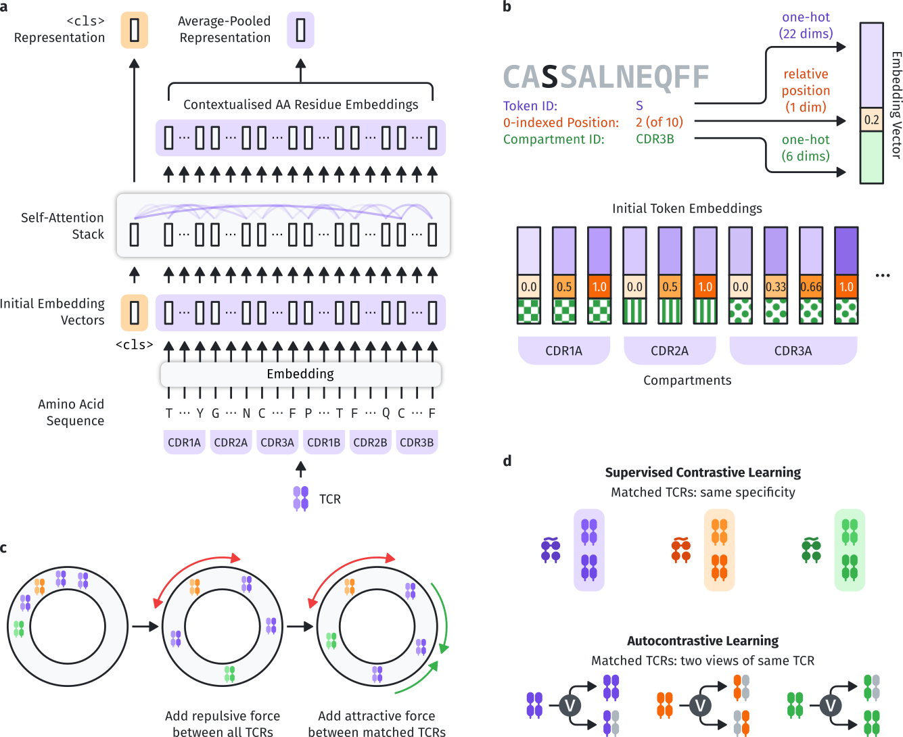

SCEPTR
======

**SCEPTR** (\ **S**\ imple **C**\ ontrastive **E**\ mbedding of the **P**\ rimary sequence of **T** cell **R**\ eceptors) is a small, fast, and performant TCR representation model that can be used for alignment-free downstream TCR and TCR repertoire analysis such as TCR clustering or classification.
Our `manuscript (coming soon) <about:blank>`_ demonstrates SCEPTR's state-of-the-art performance (as of 2024) on downstream TCR specificity prediction.

SCEPTR is a BERT-like transformer-based neural network implemented in `Pytorch <https://pytorch.org>`_.
With the default model providing best-in-class performance with only 153,108 parameters (typical protein language models have tens or hundreds of millions), SCEPTR runs fast- even on a CPU!
And if your computer does have a `CUDA-enabled GPU <https://en.wikipedia.org/wiki/CUDA>`_, the sceptr package will automatically detect and use it, giving you blazingly fast performance without the hassle.

sceptr's :ref:`API <api>` exposes three intuitive functions: :py:func:`~sceptr.calc_vector_representations`, :py:func:`~sceptr.calc_cdist_matrix`, and :py:func:`~sceptr.calc_pdist_vector`-- and it's all you need to make full use of the SCEPTR models.
What's even better is that they are fully compliant with `pyrepseq <https://pyrepseq.readthedocs.io>`_'s `tcr_metric <https://pyrepseq.readthedocs.io/en/latest/api.html#pyrepseq.metric.tcr_metric.TcrMetric>`_ API, so sceptr will fit snugly into the rest of your repertoire analysis toolkit.

   A visual introduction to how SCEPTR works, taken from our SCEPTR preprint.
   SCEPTR is a TCR language model (a,b) pre-trained using masked-language modelling and autocontrastive learning (c,d).
   (a) The default model uses the ``<cls>`` pooling method, but there is also a variant that is trained to use average-pooling (see :py:func:`sceptr.variant.average_pooling`).
   Please see the manuscript for more details.

.. toctree::
   :maxdepth: 2
   :caption: Contents:

   installation
   usage
   api
   citing

Indices and tables
==================

* :ref:`genindex`
* :ref:`modindex`
* :ref:`search`
