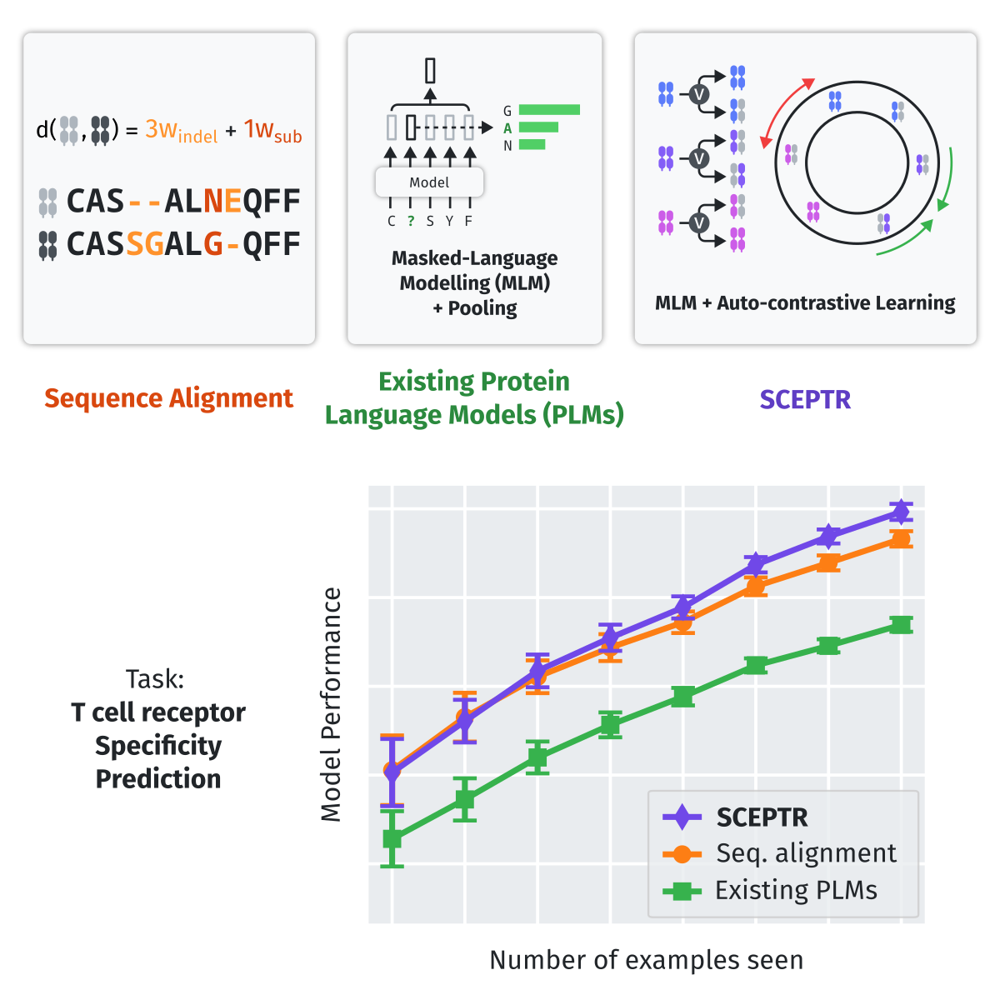

SCEPTR
======

**SCEPTR** (\ **S**\ imple **C**\ ontrastive **E**\ mbedding of the **P**\ rimary sequence of **T** cell **R**\ eceptors) is a small, fast, and accurate TCR representation model that can be used for alignment-free TCR analysis, including for TCR-pMHC interaction prediction and TCR clustering (metaclonotype discovery).
Our `manuscript <https://www.cell.com/cell-systems/fulltext/S2405-4712(24)00369-7>`_ demonstrates that SCEPTR can be used for few-shot TCR specificity prediction with improved accuracy over previous methods.

SCEPTR is a BERT-like transformer-based neural network implemented in `Pytorch <https://pytorch.org>`_.
With the default model providing best-in-class performance with only 153,108 parameters (typical protein language models have tens or hundreds of millions), SCEPTR runs fast- even on a CPU!
And if your computer does have a `CUDA- <https://developer.nvidia.com/cuda-zone>`_ or `MPS-enabled <https://developer.apple.com/documentation/metalperformanceshaders>`_ GPU, the sceptr package will automatically detect and use it, giving you blazingly fast performance without the hassle.

sceptr's :ref:`API <api>` exposes four intuitive functions: :py:func:`~sceptr.calc_cdist_matrix`, :py:func:`~sceptr.calc_pdist_vector`, :py:func:`~sceptr.calc_vector_representations`, and :py:func:`~sceptr.calc_residue_representations` -- and it's all you need to make full use of the SCEPTR models.
What's even better is that they are fully compliant with `pyrepseq <https://pyrepseq.readthedocs.io>`_'s `tcr_metric <https://pyrepseq.readthedocs.io/en/latest/api.html#pyrepseq.metric.tcr_metric.TcrMetric>`_ API, so sceptr will fit snugly into the rest of your repertoire analysis toolkit.

   Graphical abstract.
   Traditional protein language models that are trained purely on masked-language modelling underperform sequence alignment models on TCR specificity prediction.
   In contrast, our model SCEPTR is jointly trained on masked-language modelling and contrastive learning, allowing it to outperform other language models as well as the best sequence alignment models to achieve state-of-the-art performance.

.. toctree::
   :maxdepth: 2
   :caption: Contents:

   installation
   usage
   api
   citing

Indices and tables
==================

* :ref:`genindex`
* :ref:`modindex`
* :ref:`search`
